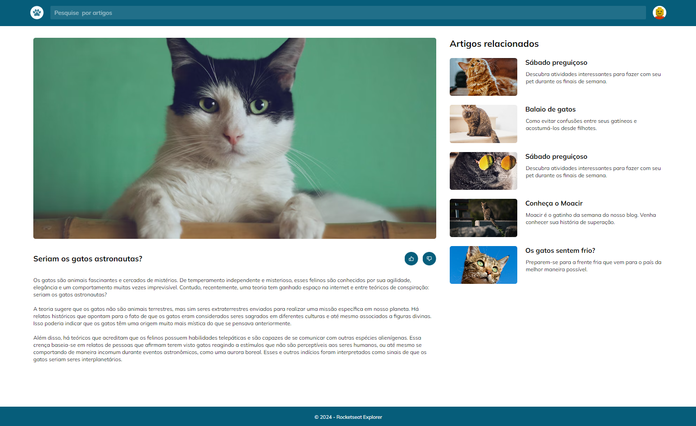

  

## 🖥️ Projeto

O projeto é um site modelo desenvolvido para o curso de desenvolvimento full-stack da Rocketseat.

## 🚀 Tecnologia

Esse projeto foi desenvolvido com as seguintes tecnologias:

- HTML
- CSS
- GIT e GITHUB

## 🏷️ Layout

Você pode visuzalizar o layout do projeto através 
[Desse link](https://www.figma.com/design/SLah627tGBPoVubvmURERN/Blog-de-Gatos-%E2%80%A2-Desafio-Explorer-(Community)?node-id=0-1&m=dev).
É necessário ter uma conta no [Figma](https://www.figma.com)